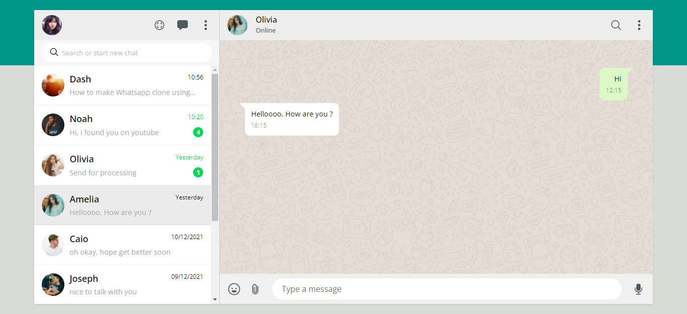

<div align="center">
    <h1 align="center">Whatsapp Web Design</h1>
    <p>Criação da interface do WhatsApp Web para treino e fixação dos conteúdos aprendendido durante a aula.</p>
    
</div>

---
<h3 align="center">
  <a href="https://whats-app-design.vercel.app/">Acessar demonstração</a>
</h3>

## Índice

* [Descrição](#descrição)
* [Techs](#techs)
* [Design](#design)
  * [Cores](#cores)
  * [Tipo de fonte](#tipo-de-fonte)
  * [Pacote de ícones](#pacote-de-ícones)
* [Instalação](#instalação)
* [Links Contato](#links-contato)

# Descrição
Criação da interface do WhatsApp Web para treino e fixação dos conteúdos aprendendido durante a aula [**@Online Tutorials**](https://www.youtube.com/watch?v=2vfT5nwNvNo)

# Techs: 
- **HTML**
- **CSS**

# Design:
- O modelo final para desktop está disponível na pasta `./design`
- Imagens disponíveis na pasta `./assets`<br>

## Cores:
-white: #fff<br>
-green: #06d755<br>
-gray: #aaa<br>
-color-header: #ededed<br>
-color-icons: #51585c<br>
-color-span: #555<br>
-color-title: #111<br>
-color-message: #dcf8c6<br>

## Tipo de fonte:
- **Open Sans** Regular 400, Medium 500, Bold 700


## Pacote de ícones:
- **Ion Icons**

# Instalação:
```bash
  # Clone este repositório:
  $ git clone https://github.com/GabrielChagas1/WhatsAppDesign.git
  $ cd ./WhatsappDesign
```

# Links Contato
- **Linkedin:** https://www.linkedin.com/in/gabriel-serqueira-chagas/<br>
- **GitHub:** https://github.com/GabrielChagas1<br>